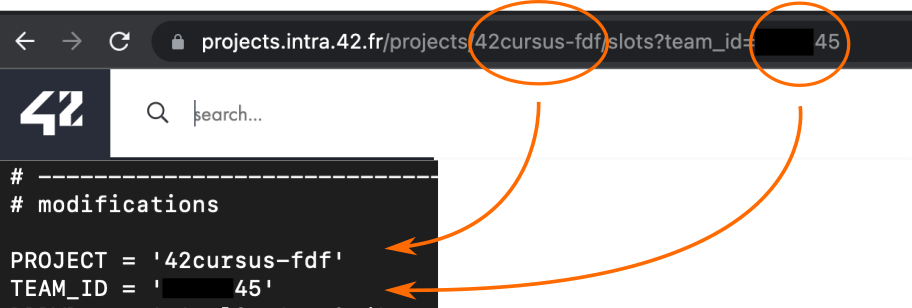

# 42_slots
42 correction slots text-based monitor

## Install requirements

`pip3 install -r requirements.txt`

modify **PROJECT** and **TEAM_ID** variables inside *slots.py* before running.

## RUN

`python3 slots.py`

or

`chmod +x slots.py`
`./slots.py`
