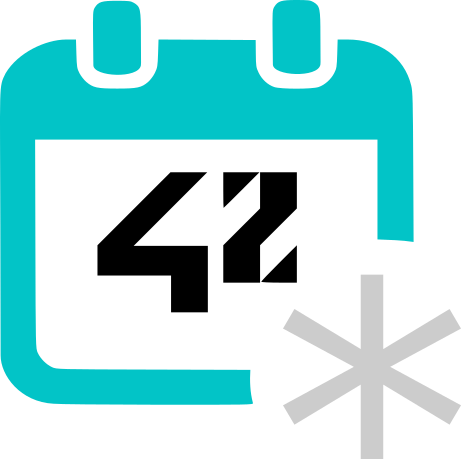
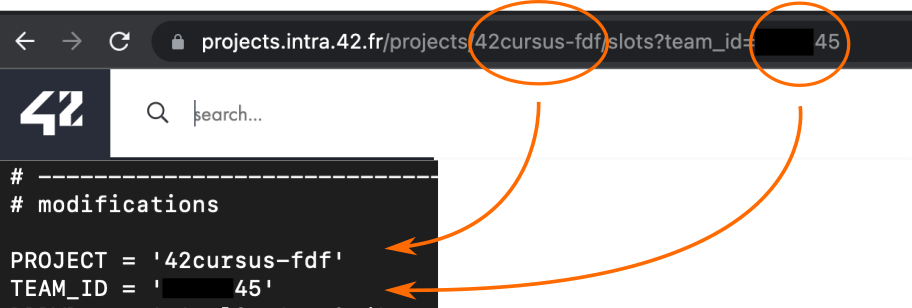

<h1 align="center">
  <br>
  <a href="https://github.com/AndreIglesias/42_slots"></a>
  <br>
  42_Slots
  <br>
</h1>

<h4 align="center">42 <a href="https://intra.42.fr/" target="_blank">correction slots</a> text-based monitor
</h4>

## How To Use

To clone and run this application from your command line:

---
First clone and install dependencies:
```bash
# Clone this repository
$ git clone https://github.com/AndreIglesias/42_slots/

# Go into the repository
$ cd 42_slots

# Install dependencies
$ pip3 install -r requirements.txt
```
Setup the **PROJECT** and **TEAM_ID** variables at the top of *slots.py*:



It is optional to modify the **DBPWD** variable if you choose to use the keypass database to store your credentials.

---
```bash
# Run the app
$ ./slots.py
```

## License

> [GPL v3.0](https://github.com/AndreIglesias/42_slots/blob/main/LICENSE) &nbsp;&middot;&nbsp;
> [@AndreIglesias](https://github.com/AndreIglesias)
